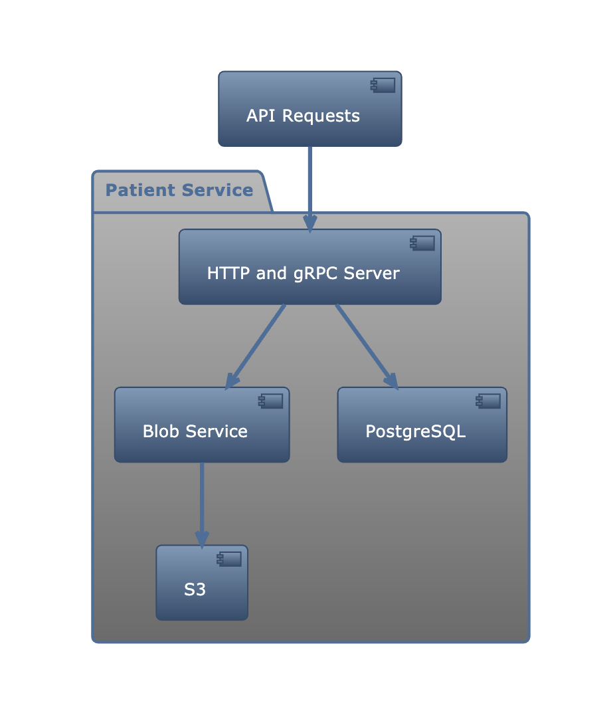
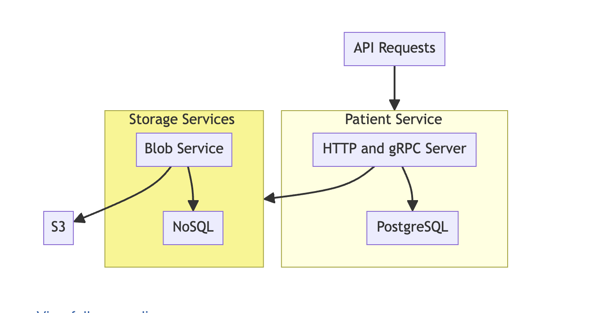
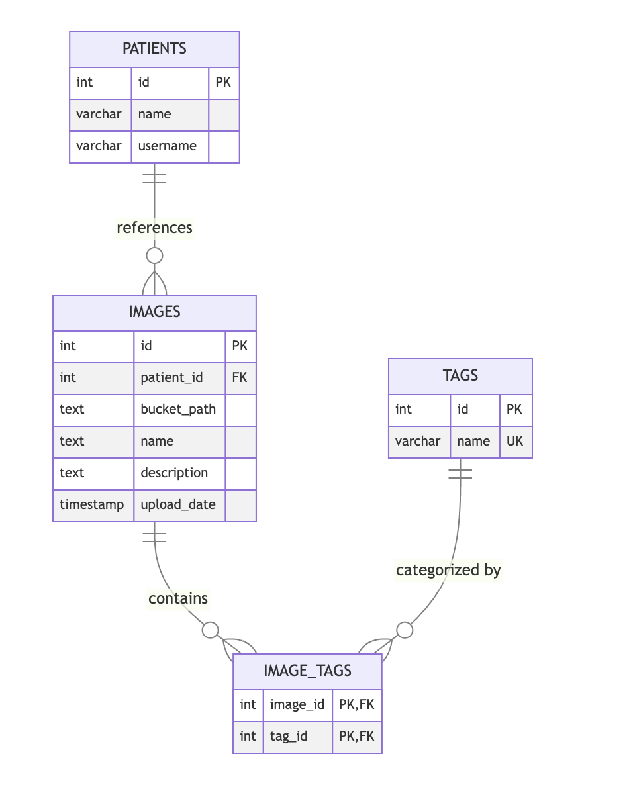
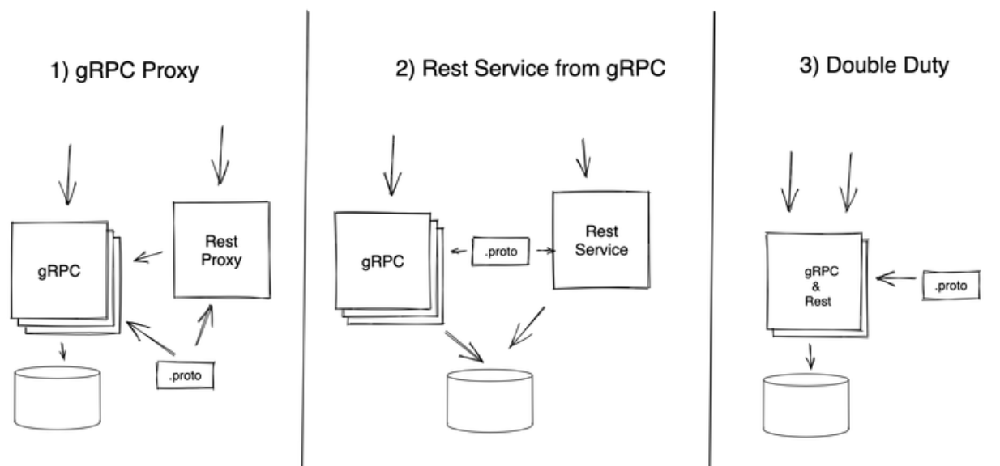

# Patient-Image-Service

## Tech Stack Breakdown

- **Golang**
- **Docker**
- **MinIO**: An object storage solution that mimics AWS S3, providing a reliable and scalable storage option for files and data. Consider as a dummy S3
- **PostgreSQL**
- **Protobuf**: Facilitates streamlined data serialization and communication, making data exchanges more efficient.
- **Prometheus**: Initially considered for system monitoring but currently not in use.

NOTE: the script runs docker prune: comment if you have docker images in use

_the below scripts adds default data to minio and postgres_

INFO[0000] Data Store Service: starting HTTP/1.1 REST server on: :9797
INFO[0000] Starting gRPC server on: localhost:9798

localhost ports in use   
http 9797  
grpc 9798  
minio on 9000, 9001  username:password is minioadmin:minioadmin  
UI 3000  

## To Run On Docker =  (currently file upload is not supported. can be seen as Prod env, no need to install the other  prerequisites)
**Go to "Project" root terminal-  **
chmod +x docker_build_all.sh  
./docker_build_all.sh  
docker logs -f "patient-service"

## To Run locally

project needs to be in $GOPATH

install protobuf protobuf-dev

go install google.golang.org/protobuf/cmd/protoc-gen-go@latest
go install google.golang.org/grpc/cmd/protoc-gen-go-grpc@latest
go install github.com/grpc-ecosystem/grpc-gateway/v2/protoc-gen-grpc-gateway@latest
go install github.com/grpc-ecosystem/grpc-gateway/v2/protoc-gen-openapiv2@latest

**Run in "Project" root terminal-  **
export WORKSPACE_DIR=$(pwd)  
echo "Workspace set to $WORKSPACE_DIR"  
chmod +x ./build/etc/dev/build_all.sh  
./build/etc/dev/build_all.sh  
chmod +x ./bin/patient_service  
./bin/patient_service -dev  

** For UI
for got Frontend directory  
npm i  
npm run start  
should be running on port 3000

**Minio
http://localhost:9001/browser/mybucket

## Current Setup: Patient-Service
The current implementation is a single service implementation called patient-service which talks to PostgreSQL and another sub-service called blob-service.
It exposes both a REST and gRPC endpoint.
Blob-service, currently part of the patient-service.
In the future, we can remove the blob-service from patient-service and it can be a complete separate service having its own database.
Since we have a single service now, i.e., the patient-service, I have kept the PostgreSQL schema simple (per service db)

### Blob Service
The blob service uses AWS SDK 2 for file upload/download/create bucket operations.
It talks to MINIO which is s3 compatible storage.
The blob service is named so because it can be used to upload blobs of any types not just images.
The bucket can be configurable by the client. (There is a createBucket method exposed, currently hardcoding to "mybucket").
This service can be enhanced further for far more S3 operations which are supported by AWS SDK.

### Database Simplicity
Files might require NoSQL because of their nature of having metadata, especially after processing.
The creation and searching of tags, especially with SQL, is limited since we need to create the tag first,
unlike NoSQL where we can assign tags dynamically.
Something like NoSQL/key-value like DynamoDB or something like MongoDB.

### GRPC Gateway Integration
A GRPC gateway is employed to bridge RESTful services with GRPC communication,
enabling both external REST access and internal GRPC messaging.
This dual communication strategy enhances flexibility.
NOTE. introduces complexities in error handling that can be further addressed.

## Future Directions

- **Blob Service Independence**: Blob service can evolve into a standalone entity, equipped with its own database (I can think of nosql right now)
  This move aims to increase the system's modularity and capacity for handling diverse file types.

- **Database Evolution**: Transitioning to a NoSQL database model for blobs would be better to accommodate
  the nuanced requirements of file metadata and tagging, offering a more adaptable framework for data management.

- **GRPC Gateway Refinement**: Efforts to streamline the GRPC gateway's error handling processes.
  Further work is need right now especially for error handling scenario.

##  Current Architecture

##  Future Architecture

##  Current databsae schema

##  Current endpoints
Using GRPC gateway as seen in the diagram using grpc-gateway so we can expose our ports as REST and on grpc for internode service communication
drawback is error handling is not smooth, needs some extra work there.

##  Alternate consideration
AWS Cloud Development Kit (AWS CDK), AWS Lambda, DynamoDB, and S3.

# Endpoints
Please check the Swagger s3_service.swagger.json and the s3_service.proto file in protos directory.
[Link to the swagger file]('https://github.com/rohitb7/project/blob/main/protos/s3_service.swagger.json')

# Asynchronous operations
For asynchronous operations, there's an async_runner (check async_runner file).
File uploads occur asynchronously now instead of using presigned URLs.
Why preassignedUrl not for uploads?
The choice depends on the use case. It's preferable not to block the client,
especially for large file uploads. This can be controlled by a flag setting.
This approach will increase the server's workload since files are temporarily stored on the server
instead of being delegated to MinIO/S3.
However, essential file processing, such as data extraction using worker nodes, is a popular use case.
Depends upon the use case!

Working ofTask Manager, Worker pool, Workers, JobManager

The system operates as follows:

Upon initialization, the Task Manager is configured with a pool of worker channels (workerPool) and a task queue (taskQueue) to manage tasks.
It starts with a specified number of workers (maxWorker) and a name for identification.

Workers are created and added to the worker pool during Task Manager startup. Each worker has its own channel for receiving tasks.

Tasks are submitted to the Task Manager via the SubmitTask method.
The Task Manager adds tasks to its task queue for later distribution to available workers.

The Task Manager's dispatch goroutine continuously listens for incoming tasks from the task queue.
When a task is available, the Task Manager selects an idle worker channel from the worker pool.
It dispatches the task to the selected worker's channel for execution.

Each worker listens for tasks on its channel.
When a task is received, the worker executes it.
Task Completion:

Upon task completion, the worker becomes idle again, and its channel is returned to the worker pool for reuse.
Job Management Integration:

The Job Manager interacts with the Task Manager to register, remove, and cancel jobs.
Registering a job involves submitting the task to the Task Manager for execution by the worker pool.
Removing a job removes it from the Task Manager's internal context.
Canceling a job cancels its associated task execution through context cancellation.
Shutdown:

When the Task Manager is stopped, it signals all workers to stop execution and closes its channels.
This ensures a graceful shutdown of the Task Manager and its associated workers.

# Synchronous operations
File downloads occur synchronously using a presigned URL.

# ---------------------------------------------

## How did you choose your design/architecture and what characteristics did you look for?
mentioned above...   

Future considerations  
-Nature of data  
-Scalability  
-Single point of failure  
-loosely coupling   
if we separate the 2 services

## Why did you choose the particular technology/framework/coding language?
Unlike traditional threads, Goroutines are cheap to create and have minimal overhead,
making it practical to use thousands or even millions of Goroutines within a single application.
I work on a system where at a once we are creating more than 20K threads and still see very minimum cpu and memory utilization.
For database, Any sql would do,I have familiarity with postgres.
**Also like I mentioned, for file metadata a nosql and schemaless database is appropriate, especially for tags which can be indexed better in nosql, To keep the scope simple I have used postgres only**

##  If you had another week of prototyping time, what functionality would you want to add?
As discussed above separate the patient-service and make patient-service and blob service

ideally....   
**patient-service =>  mysql for patient**s   
**blob-service =>  nosql for file metadata + s3**

currently....   
patient-service =>  mysql for patients + blob-service   
blob-service =>  s3

Unit tests  
Scale testing   
Defining limits for cpu and memory utilization best and worst cases   
Meta monitor / prometheus counters   
Redis?? couple if cases I have (not implemented) where redis can play a huge role   
Jobs table in db, which will store each jobs status (wrote code see job_manger but does not store in db)   
Events table in db. which will store progress events (wrote code but does not store in db)   
IAM, aws keys storage consideration  
DB indexes   
Setup a NATS client and test 
Logs in elastic logstash   
UI for all above   

## If we wanted to deploy this to a real hospital setting, what features would we need to add and what other development activities would you want to do before declaring it ready?

Adding far more REST endpoints required in an enterprise application  
Handling scalability using Data replication, CDN, utilize messaging like kafka, caching  
Authentication  
Authorization  
Dynamic tags  
Health checks  
Searching. No search implemented currently in any api.  
Also enhance the blob-service for more features. AWS sdk helps in that. It can be a service for other services.  

Also all the above mentioned earlier.

**Pending items..
makefile ..using bash scripts for now
API error handling and status codes ,
ideally there should be data massaging to tell the user what exactly the error is.**

